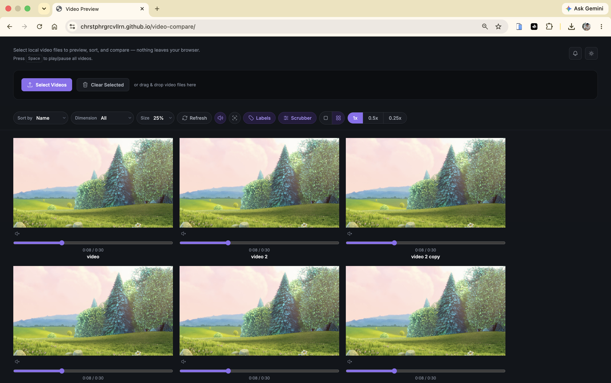

# video-compare

Preview and compare local video files side by side, all in the browser — nothing is uploaded anywhere.

Live at: https://chrstphrgrcvllrn.github.io/video-compare/



## Why

Comparing a batch of video creatives one at a time in Finder's Quick Look is slow. This tool lets you select (or drag & drop) a whole batch of local video files and plays them all at once, side by side, so you can eyeball a set of exports together instead of clicking through them one by one.

Everything runs client-side via the File API and `URL.createObjectURL` — no server, no upload, no wait. Closing or reloading the tab clears the loaded videos (nothing persists), so it's meant for a quick side-by-side look, not storage.

## Features

- Drag & drop or file-picker selection of multiple local videos
- Autoplay grid with adjustable playback speed (1x / 0.5x / 0.25x)
- Per-video scrubber and duration readout (toggleable)
- Sort by name or by dimension
- Filter by detected video dimension, or by manually selected videos ("Show Selected Only") for side-by-side comparison
- Adjustable preview size (100% / 75% / 50% / 25% / 15% of native resolution)
- Toggleable name labels
- Light / dark theme, following system preference by default
- Control preferences persist across reloads via `localStorage`

## Local development

```bash
npm install
npm run dev      # start the dev server
npm run build    # production build to dist/
npm run preview  # preview the production build locally
```

Or, once linked globally (`npm link`), run `video-preview` from any terminal to launch it.

## Tooling

```bash
npm run lint          # ESLint
npm run format        # Prettier (writes)
npm run format:check  # Prettier (check only)
npm run knip           # unused files/exports/dependencies
```

## Deployment

Pushing to `main` triggers `.github/workflows/deploy.yml`, which builds the app and publishes `dist/` to GitHub Pages.
